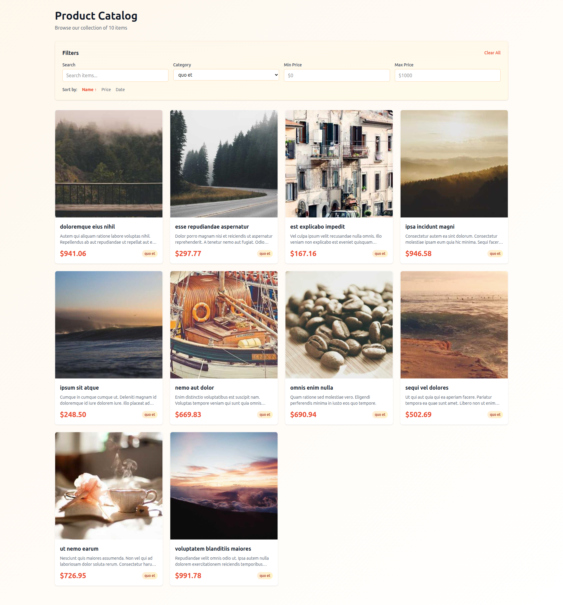

# Catalog + Multi-Channel Messaging System

[]()
[]()
[](https://www.docker.com/)
[](https://livewire.laravel.com)
[]()
[](https://laravel.com)
[](LICENSE)
[](https://php.net)

Powered by **Laravel 12**, **Livewire 3**, **Sail**, **MySQL**

---

## 🚀 Overview
This project is a lightweight, fully Dockerized Laravel 12 application that provides:

- A simple **read-only product catalog**
- Access through a **modern Livewire 3 web interface**
- Access through **Telegram Bot**, **WhatsApp Cloud API**, and **Instagram Messaging API**
- A clean, modular messaging architecture derived from `chats-crm-system`
- **No admin panel**, **no CRUD** — all content is generated via **Factories + Seeders**

### Perfect for:
- Small catalogs
- Micro-commerce shops
- Telegram / WhatsApp / Instagram sales bots
- MVPs & prototypes
- Personal digital storefronts

---



---

## 🧱 Tech Stack

| Feature | Technology |
|--------|------------|
| Framework | Laravel 12 |
| Realtime UI | Livewire 3 |
| Styling | TailwindCSS |
| Docker | Laravel Sail |
| Database | MySQL 8 |
| Messaging Channels | Telegram, WhatsApp Cloud, Instagram Messaging |
| Boilerplate Base | chats-crm-system |

No Redis. No queues. No Horizon. No admin dashboard.

---

## 📦 Features

### Catalog
- Group listing  
- Item listing  
- Items by group  
- Item detail view  
- Simple, elegant Livewire UI  

### Messaging Integrations
- Telegram bot support (webhook)  
- WhatsApp Cloud API support  
- Instagram Messaging API support  
- Unified `CatalogService` for all integrations  

Supported bot commands:

#### Telegram
```

/start
/catalog
/groups
/items
/items {group_slug}
/item {item_slug}

```

#### WhatsApp / Instagram
```

catalog
groups
items
item <slug>

```

---

## 📂 Project Structure
```

app/
Models/Group.php
Models/Item.php
Services/
CatalogService.php
TelegramService.php
WhatsAppService.php
InstagramService.php
Http/
Controllers/
Web/
GroupController.php
ItemController.php
Api/
TelegramWebhookController.php
WhatsAppWebhookController.php
InstagramWebhookController.php
resources/
views/livewire/
group-list.blade.php
item-list.blade.php
item-show.blade.php
routes/
web.php
api.php
database/
migrations/
seeders/
factories/

````

---

## 🐳 Installation (Laravel Sail + MySQL)

```bash
git clone https://github.com/your-user/catalog-messaging
cd catalog-messaging

cp .env.example .env

composer install
npm install
npm run build

./vendor/bin/sail up -d

./vendor/bin/sail artisan migrate --seed
````

---

## 📡 Webhooks Setup (ngrok)

Webhook URLs when using Sail + ngrok:

```
https://your-ngrok-url/api/telegram/webhook
https://your-ngrok-url/api/whatsapp/webhook
https://your-ngrok-url/api/instagram/webhook
```

Register these in:

* Telegram Botfather
* WhatsApp Cloud API setup
* Facebook App (Instagram)

---

## 📱 Livewire Frontend

Available pages:

* `/groups`
* `/items`
* `/items/{group}`
* `/item/{slug}`

---

# Chats Catalog System

This project extends the `BorschCode/chats-crm-system` boilerplate to create a lightweight **Catalog + Messaging** system using **Laravel 12**, **Livewire 3**, and **TailwindCSS**.

It is designed to be a read-only product catalog accessible via a simple web interface and multiple messaging channels.

## 🧱 Tech Stack

*   **Framework:** Laravel 12
*   **Frontend:** Livewire 3 + Vite + TailwindCSS
*   **Backend:** PHP 8.3+
*   **Database:** MySQL
*   **Containerization:** Laravel Sail (Docker)

## 🐳 Setup and Installation

This application uses **Laravel Sail** for local development via Docker.

### 1. Clone the Repository

```bash
git clone https://github.com/BorschCode/chats-crm-system chats-catalog-system
cd chats-catalog-system
```

### 2. Environment Setup

Copy the minimal environment file and generate an application key.

```bash
cp .env.example .env
# Replace 'YOUR_APP_KEY_HERE' in .env with a generated key
php artisan key:generate
```

### 3. Start Sail and Install Dependencies

Start the Docker containers and install the PHP dependencies.

```bash
# Start the containers (this will build the images the first time)
./vendor/bin/sail up -d

# Install PHP dependencies
./vendor/bin/sail composer install

# Install Node dependencies and build assets
./vendor/bin/sail npm install
./vendor/bin/sail npm run dev
```

### 4. Database Migration and Seeding

Run the migrations to create the `groups` and `items` tables, and seed the database with sample data.

```bash
./vendor/bin/sail artisan migrate --seed
```

### 5. Access the Application

The web catalog will be available at:

*   **Web Catalog:** `http://localhost` (or the port specified in your `.env` file)

## 🛒 Catalog Features (Web Frontend)

The catalog is built with Livewire 3 and provides a simple, read-only browsing experience.

| Route | Livewire Component | Description |
| :--- | :--- | :--- |
| `/` | `ItemList` | View all items (default homepage) |
| `/groups` | `GroupList` | View all product groups |
| `/items/{groupSlug}` | `ItemList` | View items filtered by a specific group |
| `/item/{slug}` | `ItemShow` | View individual item details |

## 💬 Communication Channels (Webhooks)

The system includes placeholder webhook controllers and services for three messaging platforms. These services are integrated with the `CatalogService` to respond to user commands.

| Channel | Webhook URL (POST) | Supported Commands |
| :--- | :--- | :--- |
| **Telegram** | `/api/webhook/telegram` | `/start`, `/catalog`, `/groups`, `/items`, `/items {group}`, `/item {slug}` |
| **WhatsApp** | `/api/webhook/whatsapp` | `catalog`, `groups`, `items`, `item <slug>` |
| **Instagram** | `/api/webhook/instagram` | `catalog`, `groups`, `items`, `item <slug>` |

***Note:** The messaging services only log the response to the Laravel log file. To make them functional, you would need to implement the actual API calls to the respective messenger platforms and configure the webhooks.*


## 📘 License

MIT or choose your own.


